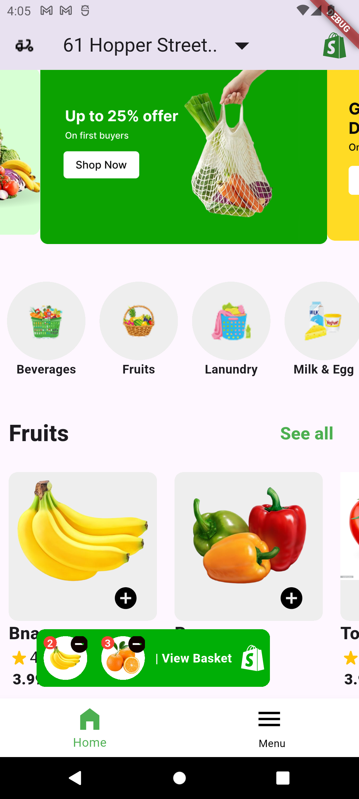
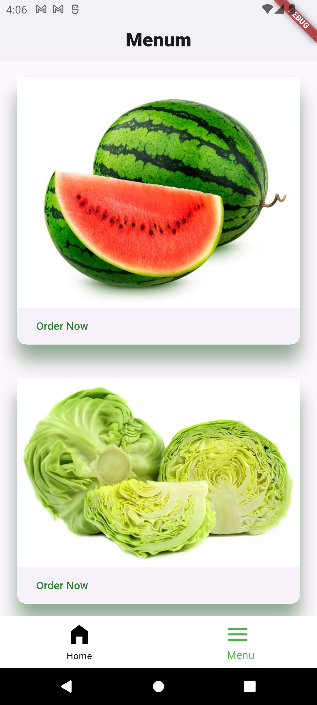

# 🥦 Vegetables & Fruits Store App

A Flutter mobile application for browsing and ordering vegetables, fruits, and groceries.  
The app features a **carousel slider**, product listing, category icons, order basket, and a simple menu page.  

## 📸 Screenshots
Here are some screenshots from the app:





## 🚀 Features
- 🖼 **Carousel Slider** for promotional banners.
- 📂 **Categories Section** with clickable icons.
- 🛒 **Add to Basket** functionality with quantity updates.
- 📜 **Horizontal Product Listing**.
- 📋 **Menu Page** with list of all items.
- 🧭 **Bottom Navigation Bar** for page switching.

## 🛠 Technologies Used
- **Flutter** (Dart)
- **carousel_slider** package
- **gap** package

## 📦 Dependencies
Add these dependencies to your `pubspec.yaml`:
```yaml
dependencies:
  flutter:
    sdk: flutter
  carousel_slider: ^5.1.1
  gap: ^3.0.1
